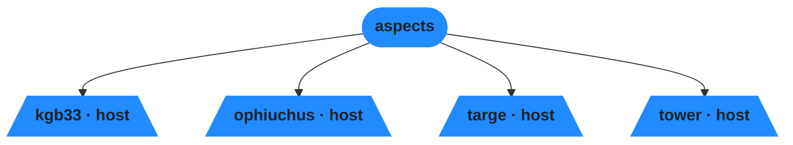

## Aspect Namespace

```mermaid
graph TD
  aspects([aspects]):::root
  kgb33[/"kgb33 · host"\]:::kgb33_c
  ophiuchus[/"ophiuchus · host"\]:::ophiuchus_c
  targe[/"targe · host"\]:::targe_c
  tower[/"tower · host"\]:::tower_c

  aspects --> kgb33
  aspects --> ophiuchus
  aspects --> targe
  aspects --> tower

  classDef root fill:#218bff,stroke:#218bff,color:#1f2328,font-weight:bold
  classDef kgb33_c fill:#218bff,stroke:#218bff,color:#1f2328,stroke-width:2px
  classDef ophiuchus_c fill:#218bff,stroke:#218bff,color:#1f2328,stroke-width:2px
  classDef targe_c fill:#218bff,stroke:#218bff,color:#1f2328,stroke-width:2px
  classDef tower_c fill:#218bff,stroke:#218bff,color:#1f2328,stroke-width:2px
```
