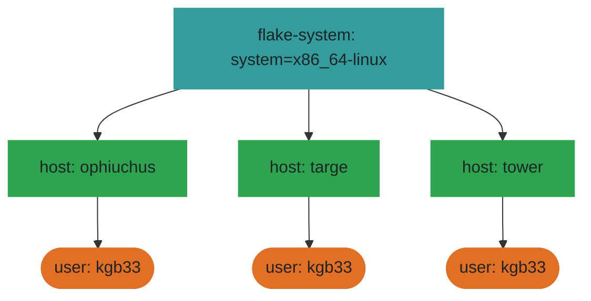

## Scope Topology

```mermaid
graph TD
  host_ophiuchus_system_x86_64_linux["host: ophiuchus"]
  host_ophiuchus_system_x86_64_linux_user_kgb33(["user: kgb33"])
  host_targe_system_x86_64_linux["host: targe"]
  host_targe_system_x86_64_linux_user_kgb33(["user: kgb33"])
  host_tower_system_x86_64_linux["host: tower"]
  host_tower_system_x86_64_linux_user_kgb33(["user: kgb33"])
  system_x86_64_linux["flake-system: system=x86_64-linux"]

  system_x86_64_linux --> host_ophiuchus_system_x86_64_linux
  host_ophiuchus_system_x86_64_linux --> host_ophiuchus_system_x86_64_linux_user_kgb33
  system_x86_64_linux --> host_targe_system_x86_64_linux
  host_targe_system_x86_64_linux --> host_targe_system_x86_64_linux_user_kgb33
  system_x86_64_linux --> host_tower_system_x86_64_linux
  host_tower_system_x86_64_linux --> host_tower_system_x86_64_linux_user_kgb33

  style host_ophiuchus_system_x86_64_linux fill:#2da44e,stroke:#2da44e,color:#1f2328
  style host_ophiuchus_system_x86_64_linux_user_kgb33 fill:#e16f24,stroke:#e16f24,color:#1f2328
  style host_targe_system_x86_64_linux fill:#2da44e,stroke:#2da44e,color:#1f2328
  style host_targe_system_x86_64_linux_user_kgb33 fill:#e16f24,stroke:#e16f24,color:#1f2328
  style host_tower_system_x86_64_linux fill:#2da44e,stroke:#2da44e,color:#1f2328
  style host_tower_system_x86_64_linux_user_kgb33 fill:#e16f24,stroke:#e16f24,color:#1f2328
  style system_x86_64_linux fill:#339D9B,stroke:#339D9B,color:#1f2328
```
